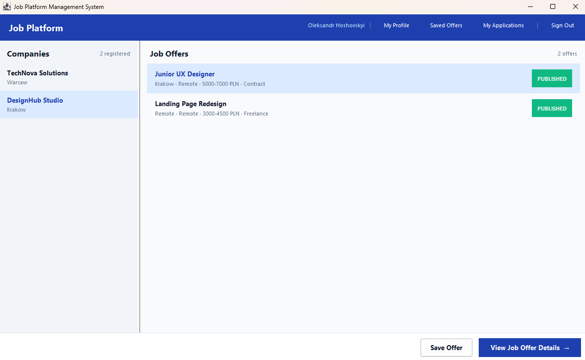
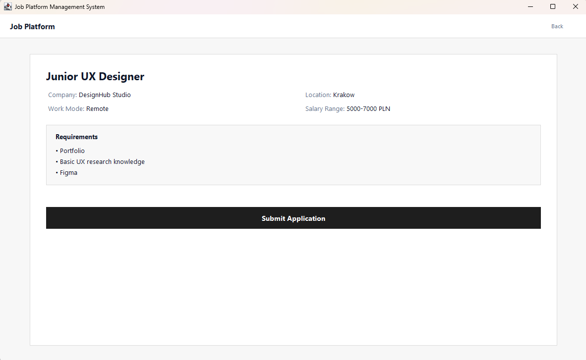

# Job Platform Management System

A desktop application for job seekers and employers built with Java Swing, Hibernate ORM, and an embedded H2 database.

The system allows job seekers to browse offers, manage their candidate profile, upload CVs, submit applications, and track their status through a full recruitment lifecycle. Employers can post job offers, review applications, schedule interviews, and manage the recruitment process.

## Main Features

**Job Seeker**
- Browse job offers by company with two-panel list navigation
- Manage candidate profile — headline, summary, preferred position, location
- Upload and manage multiple CVs, set one as default
- Add skills with proficiency level and years of experience
- Save interesting offers with personal notes
- Submit applications — CV selection, motivation message, input validation
- Track application status through the full recruitment lifecycle
- Receive notifications on status changes and scheduled interviews

**Employer**
- Post job offers — permanent, contract, or freelance type
- Publish and close offers
- Review incoming applications per offer
- Move applications through review stages
- Schedule interviews — format (video, in-person, phone), date, and time
- Accept or reject candidates
- Manage company profile

## Tech Stack

| | |
|---|---|
| Language | Java 17 |
| GUI | Java Swing |
| ORM | Hibernate 5 |
| Database | H2 embedded (file-based) |
| Build | Maven |

## Project Structure

```
src/main/java/jobplatform/
├── gui/              # Swing screens and UI components
│   ├── BrowseScreen.java
│   ├── JobOfferDetailsScreen.java
│   ├── CompleteProfileScreen.java
│   ├── SubmitApplicationScreen.java
│   ├── ConfirmationScreen.java
│   ├── MyApplicationsScreen.java
│   ├── ProfileScreen.java
│   ├── SavedOffersScreen.java
│   ├── EmployerDashboardScreen.java
│   ├── LoginScreen.java
│   └── MainFrame.java
├── model/            # Domain classes with Hibernate annotations
│   ├── enums/        # ApplicationStatus, OfferStatus
│   ├── PlatformUser.java
│   ├── JobSeeker.java
│   ├── Employer.java
│   ├── Company.java
│   ├── CandidateProfile.java
│   ├── CV.java
│   ├── Skill.java
│   ├── CandidateSkill.java
│   ├── JobOffer.java
│   ├── PermanentOffer.java
│   ├── ContractOffer.java
│   ├── FreelanceOffer.java
│   ├── Application.java
│   ├── Interview.java
│   ├── RecruitmentProcess.java
│   ├── RecruitmentStage.java
│   ├── Notification.java
│   └── SavedOffer.java
├── persistence/      # DataStore, SampleData
└── util/             # AppColors, UIFactory
src/main/resources/
└── hibernate.cfg.xml
```

## Domain Model

18 domain classes covering the full job platform business domain.

### Inheritance

| Class | Type | Implementation |
|---|---|---|
| `PlatformUser → JobSeeker / Employer` | Complete, Overlapping | Role references on PlatformUser — a user can hold both roles simultaneously |
| `JobOffer → PermanentOffer / ContractOffer / FreelanceOffer` | Complete, Disjoint | Abstract class with three concrete subclasses, `@Inheritance(JOINED)` |

### Associations

| Association | Type | Detail |
|---|---|---|
| `CandidateProfile → CV` | Composition | `orphanRemoval = true` — CV cannot exist without its profile |
| `RecruitmentProcess → RecruitmentStage` | Composition | `orphanRemoval = true` — stages belong to the process |
| `CandidateProfile ↔ Skill` | Association class | Via `CandidateSkill` — stores proficiency level and years of experience |
| `JobSeeker ↔ JobOffer` | Association class | Via `SavedOffer` — stores saved date and personal note |
| `CandidateProfile ↔ Skill` | Qualified | Qualified by SkillName — no duplicate skills per profile |

### Attributes

| Attribute | Class | Type |
|---|---|---|
| `/CompletenessLevel` | `CandidateProfile` | Derived — computed by `computeCompletenessLevel()`, not stored |
| `requirements [1..*]` | `JobOffer` | Multi-value — `List<String>`, minimum one required |

### Enumerations

| Enum | Values |
|---|---|
| `ApplicationStatus` | `SUBMITTED`, `UNDER_REVIEW`, `INTERVIEW_SCHEDULED`, `ACCEPTED`, `REJECTED` |
| `OfferStatus` | `DRAFT`, `PUBLISHED`, `CLOSED` |

## Application State Machine

Application status transitions enforced in code — invalid transitions throw `IllegalStateException`.

```
SUBMITTED → UNDER_REVIEW → INTERVIEW_SCHEDULED → ACCEPTED
                          → REJECTED
           → REJECTED
```

## Business Rules

- A job seeker cannot apply twice for the same offer
- An application can only be submitted if the offer is PUBLISHED
- The candidate profile must pass a completeness check before submission — if incomplete, the user is redirected to fill in missing fields
- The selected CV must belong to the applicant's own profile
- The motivation message cannot be empty and must be at least 20 characters
- An offer cannot be re-published after being closed
- Application status can only move through the allowed transitions defined in the state machine

## Persistence

All data is persisted using Hibernate with an H2 embedded database stored at `./data/jobplatform_db.mv.db`.

| Method | When called | What it does |
|---|---|---|
| `DataStore.load()` | Once at startup in `Main.java` | Loads all class extents from DB using HQL `from ClassName` queries |
| `DataStore.save()` | After every user action that changes data | Saves all extents in a single Hibernate transaction |
| `SampleData.load()` | First run only | Generates sample data covering all domain classes |

Key Hibernate configuration:
- `hbm2ddl.auto=update` — schema created/updated automatically on startup
- `FetchType.EAGER` on all collections — loaded immediately to avoid `LazyInitializationException` after session close
- `@Fetch(FetchMode.SUBSELECT)` — avoids Cartesian product when loading multiple parents with eager collections
- `@Enumerated(EnumType.STRING)` — enums stored as readable strings, not ordinal numbers

## Screens

| Screen | Purpose |
|---|---|
| Login | Account selection with role-based login paths |
| Browse | Two-panel company → offer list navigation via association traversal |
| Job Offer Details | Full offer info with Submit Application button |
| Complete Profile | Triggered when profile is incomplete during application submission |
| Submit Application | CV dropdown, motivation message textarea, validation |
| Confirmation | Success screen with application details and status badge |
| My Applications | Application list with status badges, interview details, notifications |
| Profile | Edit profile, manage CVs, add skills |
| Saved Offers | Bookmarked offers with direct apply option |
| Employer Dashboard | Two-panel offer → application list, status management, interview scheduling |

## Screenshots





## Running the Project

**Prerequisites:** Java 17+, Maven 3.6+

```bash
git clone https://github.com/oleksandrhoshovskyi-svg/Job-Platform.git
cd Job-Platform
mvn clean package
java -jar target/job-platform-mas-1.0.jar
```

Or open in IntelliJ IDEA and run `Main.java` directly.

On first launch, sample data is generated automatically:
- 3 companies
- Multiple job seekers, employers, and one dual-role user demonstrating overlapping inheritance
- All three offer types
- A complete application lifecycle — submitted, under review, interview scheduled

Data persists between runs in the local H2 file.
